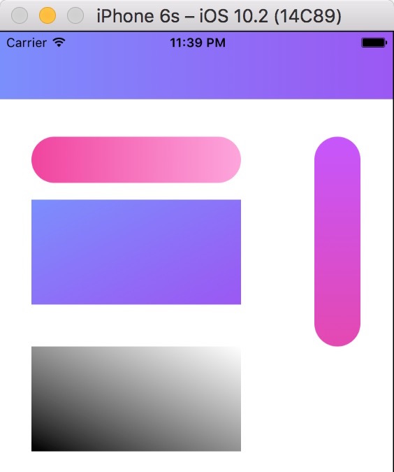
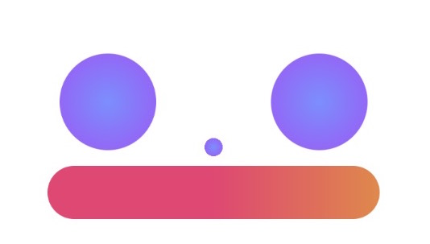
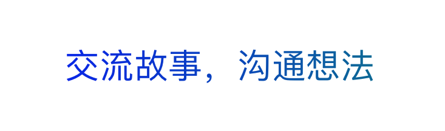

 
<div align="left">
	 
	 
	 
</div>

## WHGradientHelper
iOS渐变，支持——线性渐变，径向渐变，渐变动画，lable字体渐变，lable字体渐变动画

#### 最终效果：


- [x] 线性渐变
- [x] 径向渐变
- [x] 渐变动画
- [x] Lable字体渐变
- [x] Lable字体渐变动画

#### 1. 线性渐变(Linear Gradient)
“线性渐变”按照渐变方向分成4种类型，分别是：

```objective-c
typedef NS_ENUM(NSInteger, WHGradientDirection) {
    WHLinearGradientDirectionLevel,                 //AC - BD
    WHLinearGradientDirectionVertical,              //AB - CD
    WHLinearGradientDirectionUpwardDiagonalLine,    //A - D
    WHLinearGradientDirectionDownDiagonalLine,      //C - B
};
//      A         B
//       _________
//      |         |
//      |         |
//       ---------
//      C         D
```



#### 2. 径向渐变(Radial Gradient)



#### 3. 渐变动画(ChromatoAnimation)


#### 4. Lable字体渐变



#### 5. Lable字体渐变动画


## WHGradientHelper头文件及使用

```objective-c
#import <UIKit/UIKit.h>

#define kDefaultWidth 200
#define kDefaultHeight 200

typedef NS_ENUM(NSInteger, WHGradientDirection) {
    WHLinearGradientDirectionLevel,                 //AC - BD
    WHLinearGradientDirectionVertical,              //AB - CD
    WHLinearGradientDirectionUpwardDiagonalLine,    //A - D
    WHLinearGradientDirectionDownDiagonalLine,      //C - B
};
//      A         B
//       _________
//      |         |
//      |         |
//       ---------
//      C         D

@interface WHGradientHelper : NSObject

//   Linear Gradient
+ (UIImage *)getLinearGradientImage:(UIColor *)startColor and:(UIColor *)endColor directionType:(WHGradientDirection)directionType;/* CGSizeMake(kDefaultWidth, kDefaultHeight) */
+ (UIImage *)getLinearGradientImage:(UIColor *)startColor and:(UIColor *)endColor directionType:(WHGradientDirection)directionType option:(CGSize)size;

//    Radial Gradient
+ (UIImage *)getRadialGradientImage:(UIColor *)centerColor and:(UIColor *)outColor;/* raduis = kDefaultWidth / 2 */
+ (UIImage *)getRadialGradientImage:(UIColor *)centerColor and:(UIColor *)outColor option:(CGSize)size;

//   ChromatoAnimation
+ (void)addGradientChromatoAnimation:(UIView *)view;


//   LableText LinearGradient and ChromatoAnimation
+ (void)addLinearGradientForLableText:(UIView *)parentView lable:(UILabel *)lable start:(UIColor *)startColor and:(UIColor *)endColor;  /* don't need call 'addSubview:' for lable */
+ (void)addGradientChromatoAnimationForLableText:(UIView *)parentView lable:(UILabel *)lable; /* don't need call 'addSubview:' for lable */
```

## 具体实现
[简书地址](https://www.jianshu.com/p/1045575db4d0)
